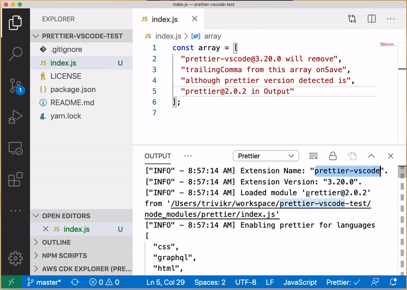

# prettier-vscode-test

Verifies that prettier-vscode v4.0.0+ formats according to prettier@2 defaults (bug [prettier/prettier-vscode#1290](https://github.com/prettier/prettier-vscode/issues/1290))

## Steps to test

- Clone this repo, and open it in VSCode
- Install [prettier-vscode extension](https://marketplace.visualstudio.com/items?itemName=esbenp.prettier-vscode) v4.0.0+
- Run `yarn` to install dependencies
- Open [index.js](./index.js), and remove trailingComma from the array
- Notice that prettier-vscode extension adds the trailingComma on Save

